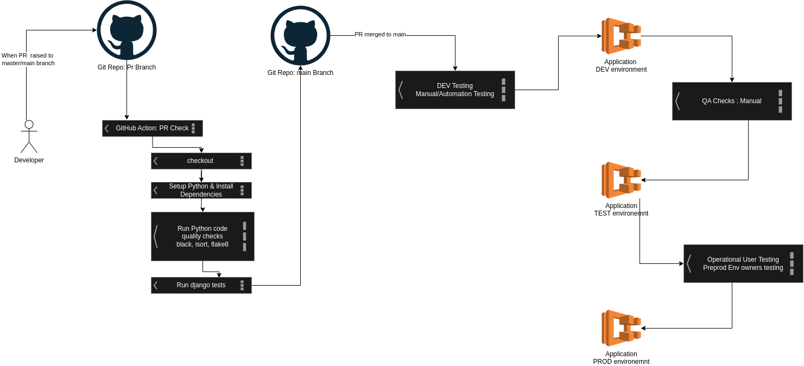

# Food Truck Locator : Path to glory of taste !
The Problem : World Needs More Food Trucks!

[](https://github.com/sifykarippery/food-truck-locator/actions/workflows/django-app.yml)

## Problem Statement 
Our team in San Francisco are on a quest to discover the hidden gems of street food, particularly food trucks! Your challenge is to to make it possible for us to find a food truck no matter where our work takes us in the city.

This is a freeform assignment. You can write a web API that returns a set of food trucks (our team is fluent in JSON). You can write a web frontend that visualizes the nearby food trucks. We also spend a lot of time in the shell, so a CLI that gives us a couple of local options would be great. And don't be constrained by these ideas if you have a better one!

The only requirement for the assignment is that it give us at least 5 food trucks to choose from a particular latitude and longitude.

Feel free to tackle this problem in a way that demonstrates your expertise of an area -- or takes you out of your comfort zone. For example, if you build Web APIs by day and want to build a frontend to the problem or a completely different language instead, by all means go for it - learning is a core competency in our group. Let us know this context in your solution's documentation.


## Built With

- pipenv  - for managing python virtual environment
- postgres - for collection of food trucks
- custom command : import_truck_data -  for importing truck data into Database
- Why not PostGis-  it requires a lot of server to be running in the machine, so if you look at the code as you can see there is all time data fetched from table then doing the search by calculation
- Django
- Used .env for all the configuration  , for secrets best practices should be from KEY Vaults , AWS Secret Manager etc
- 
## How to Run

Please run migrations after activating environments
Make sure pyenv and pipenv installed 
Please check the .python-version
Please create .env file in the folder where you see .env.example file , update credentials

```
pipenv shell          # this will activate virtual env
pipenv install        # Install dependencies

cd food_truck_locator
python manage.py migrate        # Run the migrations

python manage.py import_truck_data   # to import the sample CSV data
pythin manage.py runserver           # Run the application

```
Please open http://localhost:8000 to launch the Application

## Deployment Flow




## Things to improve

1. Google Map for Visual appealing integration 
    Searched a couple of libraries for integration , it requires some cost and integration
2. Integrate with PostGis , DjangoGeo  
    https://pganalyze.com/blog/geodjango-postgis
    It needs some PG server setup thought of integrating with the sample


